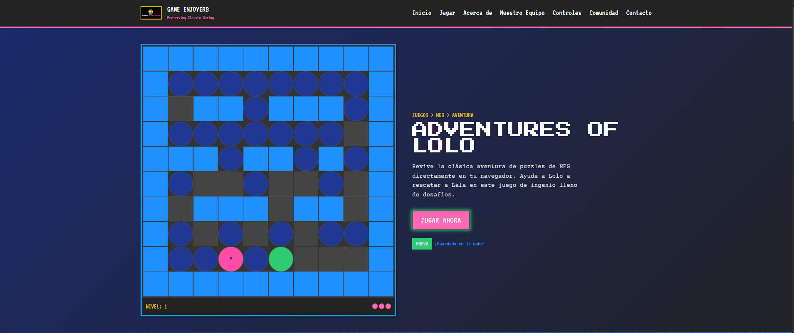

# Game Enjoyers - Adventures of Lolo

¡Bienvenido a **Game Enjoyers**! Este proyecto es una recreación web inspirada en el clásico juego de NES "Adventures of Lolo". El objetivo es preservar el legado de los videojuegos retro y ofrecer una experiencia interactiva y nostálgica para los jugadores y desarrolladores.

---

## 📁 Estructura del Proyecto

```
landing/
│
├── index.html           # Página principal (landing page)
├── login.html           # Página de inicio de sesión
├── register.html        # Página de registro de usuario
│
├── css/
│   └── tailwind.css     # Estilos personalizados y Tailwind CSS
│
├── img/
│   ├── Game Enjoyers Logo.jpg
│   ├── Coffi.jpg
│   └── Victor.png
│
├── js/
│   ├── app.js           # Lógica principal y animaciones
│   └── login.js         # Utilidades para login y landing
│
└── tailwind.config.js   # Configuración de Tailwind (opcional)
```

---

## 📸 Galería

A continuación puedes agregar imágenes del proyecto. Por ejemplo:




---

## 👨‍💻 Créditos

- **Victor Contreras**  
  C.I: 30.520.132

- **Jean Coffi**  
  C.I: 29.518.292

---